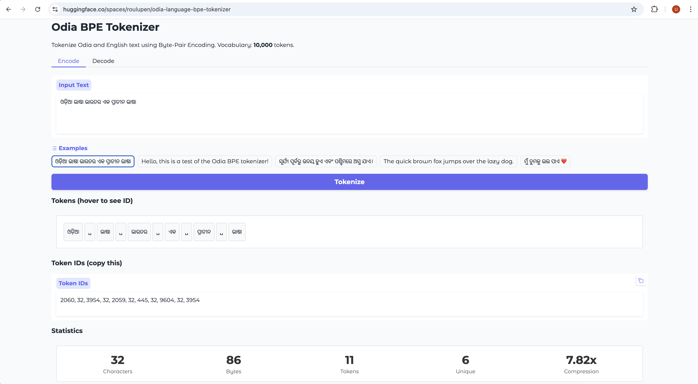
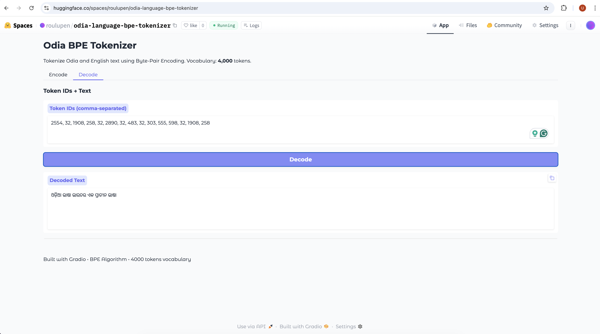
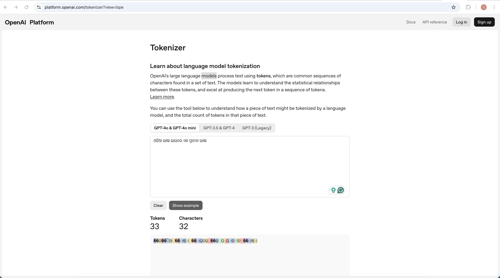

# ଓଡ଼ିଆ(Odia) Language BPE Tokenizer

A Byte-Pair Encoding (BPE) tokenizer specifically designed for the Odia (ଓଡ଼ିଆ) language, trained on real Odia text data.

## The Tokenization Challenge for Non-English Scripts

Traditional tokenizers trained primarily on English text struggle with non-English scripts like Odia because they treat complex Unicode characters inefficiently, often breaking them into multiple byte-level tokens. This results in poor compression, increased token counts, and suboptimal representation of the linguistic structure inherent to Indic scripts.

## Live Demo

Try out the tokenizer in our interactive Hugging Face Space:

🚀 **[Odia Language BPE Tokenizer Demo](https://huggingface.co/spaces/roulupen/odia-language-bpe-tokenizer)**

### Demo Interface

**Encoding Example:**



**Decoding Example:**



**GPT-4 Encoding for the same text:**


**It clearly shows the custom Odia language tokenizer I have built has better compression ratio than compared to GPT-4.**
## Odia Script Unicode Range

The Odia script uses Unicode range `U+0B00 – U+0B7F` (128 code points), which includes:
- **Independent vowels**: ଅ, ଆ, ଇ, ଈ, ଉ, ଊ, ଋ, ୠ, ଏ, ଐ, ଓ, ଔ
- **Consonants**: କ, ଖ, ଗ, ଘ ... ହ
- **Dependent vowel signs (matras)**: ୀ, ୁ, ୂ, ୃ, ୈ
- **Virama (Halant)**: ୍ (used for consonant clusters)
- **Special signs**: Anusvara (ଂ), Visarga (ଃ), Chandrabindu (ଁ)
- **Digits**: ୦–୯
- **Nukta**: For characters like ଡ଼

## Custom Split Regex for Odia

This tokenizer uses a specialized regex pattern to properly handle Odia text segmentation:

```regex
[\u0B00-\u0B7F]+|\d+|[^\s\u0B00-\u0B7F\d]+| ?[^\s\p{L}\p{N}]++[\r\n]*|\s*[\r\n]|\s+(?!\S)|\s+
```

**Pattern Breakdown:**
- `[\u0B00-\u0B7F]+` - Matches continuous Odia script characters as single chunks
- `\d+` - Matches sequences of digits
- `[^\s\u0B00-\u0B7F\d]+` - Matches non-Odia, non-digit, non-space characters
- `?[^\s\p{L}\p{N}]++[\r\n]*` - Handles punctuation with optional leading space
- `\s*[\r\n]` - Matches line breaks with optional surrounding whitespace
- `\s+(?!\S)|\s+` - Handles various whitespace patterns

This pattern ensures that Odia text is split at appropriate boundaries, preserving the integrity of complex character combinations while enabling efficient BPE training.

## Training Details

### Dataset
The tokenizer was trained on the [OdiaGenAI Pre-train Odia Data Processed](https://huggingface.co/datasets/OdiaGenAIdata/pre_train_odia_data_processed) dataset from Hugging Face.

- **Training samples**: 500,000 records
- **Training text size**: 49,299,688 characters
- **Vocabulary size**: 10,000 tokens
- **Number of BPE merges**: 9,744

### Training Logs

Below are sample logs from the BPE training process showing the most frequent merges:

```
Training tokenizer...
Text split into 14827345 chunks
merge 1/9744: (224, 172) -> 256 (�) had 31586333 occurrences
merge 2/9744: (224, 173) -> 257 (�) had 9102226 occurrences
merge 3/9744: (256, 190) -> 258 (ା) had 3680563 occurrences
merge 4/9744: (257, 141) -> 259 (୍) had 3621787 occurrences
merge 5/9744: (256, 176) -> 260 (ର) had 3412710 occurrences
merge 6/9744: (256, 191) -> 261 (ି) had 3381404 occurrences
merge 7/9744: (259, 256) -> 262 (୍�) had 2288435 occurrences
merge 8/9744: (261, 256) -> 263 (ି�) had 2233023 occurrences
merge 9/9744: (258, 256) -> 264 (ା�) had 2157223 occurrences
merge 10/9744: (257, 135) -> 265 (େ) had 1808806 occurrences
merge 11/9744: (256, 149) -> 266 (କ) had 1349971 occurrences
merge 12/9744: (257, 129) -> 267 (ୁ) had 1148230 occurrences
merge 13/9744: (256, 168) -> 268 (ନ) had 1094714 occurrences
merge 14/9744: (256, 184) -> 269 (ସ) had 1040635 occurrences
merge 15/9744: (256, 172) -> 270 (ବ) had 1031023 occurrences
merge 16/9744: (256, 170) -> 271 (ପ) had 965046 occurrences
merge 17/9744: (256, 174) -> 272 (ମ) had 848968 occurrences
merge 18/9744: (257, 159) -> 273 (ୟ) had 707372 occurrences
merge 19/9744: (256, 185) -> 274 (ହ) had 688490 occurrences
merge 20/9744: (258, 260) -> 275 (ାର) had 623466 occurrences
merge 21/9744: (259, 260) -> 276 (୍ର) had 612859 occurrences
merge 22/9744: (256, 164) -> 277 (ତ) had 601438 occurrences
merge 23/9744: (257, 139) -> 278 (ୋ) had 516884 occurrences
...

============================================================
Training Complete!
============================================================
Vocabulary size: 10000
Number of merges: 9744
Compression ratio: 7.70x
```

The tokenizer achieves a **7.70x compression ratio** on Odia text, significantly reducing token counts compared to raw byte encoding.

**Training Notebook**: [Training Notebook](./odia_tokenizer_example.ipynb)
## Usage

### Installation

```bash
# Create conda environment
conda create -n odia-tokenizer python=3.11
conda activate odia-tokenizer

# Install dependencies
pip install -r requirements.txt
```

### Training a New Tokenizer

```python
from odia_bpe_tokenizer import OdiaBPETokenizer, ODIA_SPLIT_PATTERN
from dataset import load_odia_dataset

# Load dataset
ds = load_odia_dataset('./data')

# Prepare training text
num_samples = 500000
training_text = ' '.join(ds['train']['text'][:num_samples])

# Train tokenizer
tokenizer = OdiaBPETokenizer(pattern=ODIA_SPLIT_PATTERN)
stats = tokenizer.train(training_text, vocab_size=10000, verbose=True)

# Save the model
tokenizer.save("odia_bpe_tokenizer")
```

### Using a Pre-trained Tokenizer

```python
from odia_bpe_tokenizer import OdiaBPETokenizer

# Load the tokenizer
tokenizer = OdiaBPETokenizer()
tokenizer.load("odia_bpe_tokenizer.model")

# Encode text
text = "କାର୍ତ୍ତିକ ପୂର୍ଣ୍ଣିମା ଉପଲକ୍ଷେ ସମସ୍ତଙ୍କୁ ହାର୍ଦ୍ଦିକ ଶୁଭେଚ୍ଛା"
encoded = tokenizer.encode(text)
print(f"Encoded: {encoded}")
print(f"Tokens: {len(encoded)}")

# Decode tokens
decoded = tokenizer.decode(encoded)
print(f"Decoded: {decoded}")

# Get compression statistics
stats = tokenizer.get_compression_stats(text)
print(f"Compression ratio: {stats['compression_ratio']:.2f}x")
```

### Example Output

```
Original: କାର୍ତ୍ତିକ ପୂର୍ଣ୍ଣିମା ଉପଲକ୍ଷେ ସମସ୍ତଙ୍କୁ ହାର୍ଦ୍ଦିକ ଶୁଭେଚ୍ଛା ଆଉ ଶୁଭକାମନା। ବନ୍ଦେ ଉତ୍କଳ ଜନନୀ
Encoded:  [351, 482, 306, 32, 1187, 3970, 32, 552, 638, 265, 32, 3564, 32, 893, 514, 514, 306, 32, 1963, 3240, 258, 32, 928, 32, 1963, 866, 413, 224, 165, 164, 32, 951, 265, 32, 3186, 310, 32, 706, 681]
Tokens:   39
Decoded:  କାର୍ତ୍ତିକ ପୂର୍ଣ୍ଣିମା ଉପଲକ୍ଷେ ସମସ୍ତଙ୍କୁ ହାର୍ଦ୍ଦିକ ଶୁଭେଚ୍ଛା ଆଉ ଶୁଭକାମନା। ବନ୍ଦେ ଉତ୍କଳ ଜନନୀ
Match:    True

Compression ratio: 6.18x
Bytes per token:   6.18
```

## Project Structure

```
odia-language-tokenizer/
├── base.py                    # Base tokenizer class and utilities
├── odia_bpe_tokenizer.py     # Main Odia BPE tokenizer implementation
├── dataset.py                 # Dataset loading utilities
├── odia_bpe_tokenizer.model  # Pre-trained tokenizer model
├── odia_bpe_tokenizer.vocab  # Human-readable vocabulary
├── odia_tokenizer_example.ipynb  # Jupyter notebook with examples
├── requirements.txt           # Python dependencies
├── data/                      # Cached dataset files
└── assets/                    # Demo images and resources
```

## Requirements

- Python 3.11 (recommended)
- regex
- datasets
- pandas
- jupyter
- notebook

See `requirements.txt` for complete dependency list.

## References

- **Tutorial Video**: [Building Tokenizers for Indic Languages](https://www.youtube.com/watch?v=zduSFxRajkE)
- **Dataset**: [OdiaGenAI Pre-train Odia Data](https://huggingface.co/datasets/OdiaGenAIdata/pre_train_odia_data_processed)
- **Live Demo**: [Hugging Face Space](https://huggingface.co/spaces/roulupen/odia-language-bpe-tokenizer)


---

**ବନ୍ଦେ ଉତ୍କଳ ଜନନୀ** 🙏
